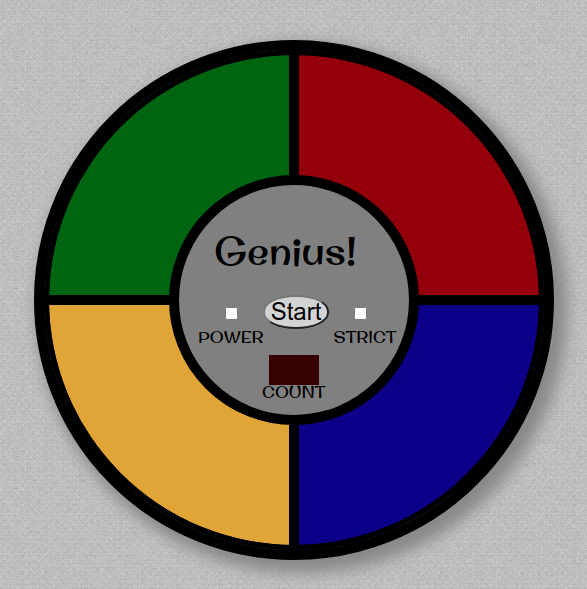

  

  
  
  

___

<h3 align="center">
  <a href="#information_source-sobre">Sobre</a>&nbsp;|&nbsp;
    <a href="#interrobang-motivo">Motivo</a>&nbsp;|&nbsp;
  <a href="#rocket-tecnologias-utilizadas">Tecnologias</a>&nbsp;|&nbsp;
  <a href="#link-como-contribuir">Como Contribuir</a>&nbsp;|&nbsp;
  <a href="#licença">Licença</a>
</h3>

___

  

 
 

## :information_source: Sobre

Jogo da Memória no estilo Genius, desenvolvido com o [Tutorial do Beau Carnes](https://youtu.be/n_ec3eowFLQ).
 
 

## :interrobang: Motivo

Na realização do Bootcamp da Digital Innovation One um dos projetos desenvolvidos foi o Jogo da Memória Genius, o que foi mergeado primeiramente.
No entanto não gostei do resultado e procurei algum tutorial que apresentasse as implementações que eu me identifico melhor.
O [Tutorial do Beau Carnes](https://youtu.be/n_ec3eowFLQ) veio de encontro com tudo que eu procura, então resolvi atualizar o jogo.

 
 

## :rocket: Tecnologias Utilizadas 

O projeto foi desenvolvido utilizando as seguintes tecnologias

- HTML5
- CSS3
- Javascript
 
 

## :link: Como contribuir 

- Faça um Fork do repositório
- Clone o seu repositório
- Crie uma branch com a sua feature
- Faça um commit com suas mudanças
- 'Push' a sua branch
- Ir em Pull Requests do projeto original e criar uma pull request com o seu commit
 
 

## Licença 

Esse projeto está sob a licença MIT. Veja o arquivo [LICENSE](LICENSE) para mais detalhes.
